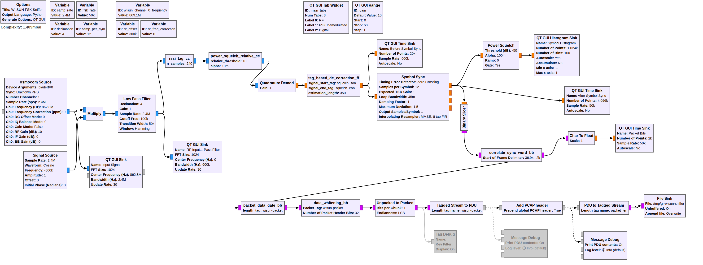
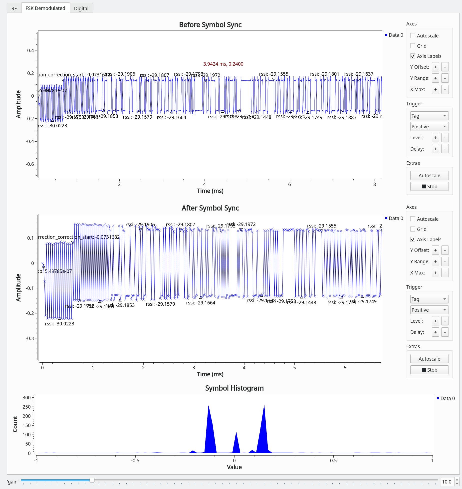
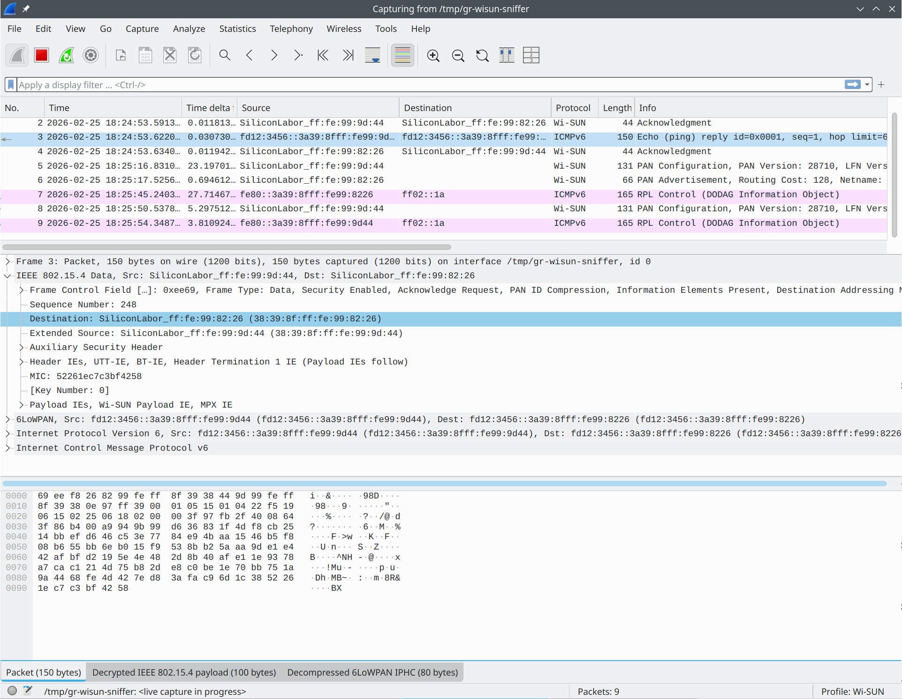

<!--
SPDX-FileCopyrightText: 2026 GARDENA GmbH

SPDX-License-Identifier: GPL-3.0-or-later
-->

Overview
========

This out-of-tree module for GNU Radio provides basic blocks to support
Wi-SUN (more specifically the SUN FSK PHY specified in section 19 of
IEEE 802.15.4-2020).

At the moment, this is mostly a proof-of-concept and only FSK
modulation is supported.

Building & Installation
=======================

To build `gr-wisun`, run these commands:

```
mkdir build
cd build
cmake -DCMAKE_INSTALL_PREFIX=/path/to/install-dir ..
make
```

Once built, installing is done with:

```
make install
sudo ldconfig
```

Tests
=====

The directory `python/wisun` contains unit tests for each block. They
can be executed with the following command (after doing the
build-steps above):

```
make test
```

An individual test can be executed with `ctest`, e.g.:

```
ctest --output-on-failure -R rssi_tag_cc
```

Examples
========

Basic Sniffer
-------------

The file `examples/basic_sniffer.grc` contains a GNU Radio Companion
flow graph for a basic sniffer. It receives packets on a single channel and writes the packet data
to a FIFO, which can be read with Wireshark (in order to see all
packets, allowed channels must be limited to use only channel 0).



The following steps are needed to use it:

- create the FIFO: `mkfifo /tmp/gr-wisun-sniffer` (if the flow graph
  was already executed, the file may exist as a regular file and needs
  to be deleted first)
- open `examples/basic_sniffer.grc` with `gnuradio-companion`
- execute the flow graph (F6); the GUI will not appear until another
  application starts reading the FIFO
- start Wireshark with `wireshark -k -i /tmp/gr-wisun-sniffer`

Packets should now be visible in the GUI and in Wireshark:



