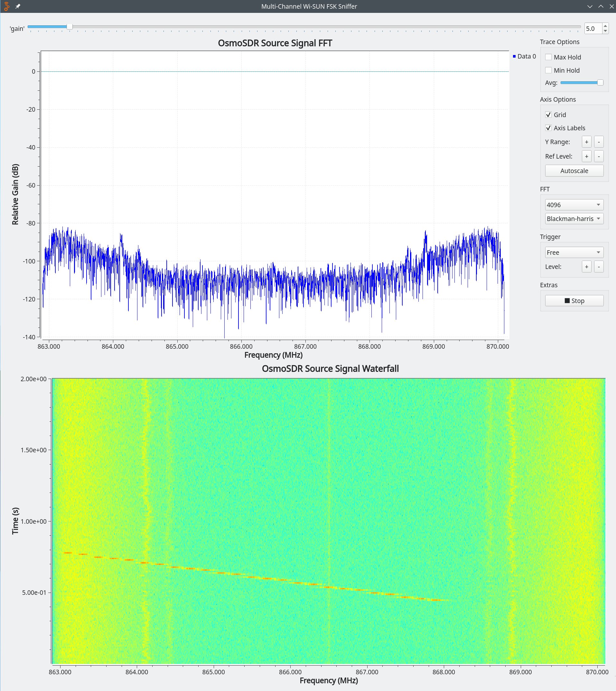
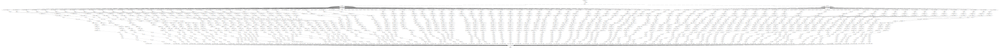

<!--
SPDX-FileCopyrightText: 2026 GARDENA GmbH

SPDX-License-Identifier: GPL-3.0-or-later
-->

Overview
========

This out-of-tree module for GNU Radio provides basic blocks to support
Wi-SUN (more specifically the SUN FSK PHY specified in section 19 of
IEEE 802.15.4-2020). It allows sniffing Wi-SUN packets and feeding
them to Wireshark.

At the moment, this is mostly a proof-of-concept and comes with the
following limitations:
- only FSK modulation is supported (no OFDM)
- only receiving is supported (packet sending not implemented)
- performance is not optimized (in particular the clock
  synchronization could use more tuning)

That said, integration with Wireshark works well, and the sniffer is
fully functional.


Building & Installation
=======================

To build `gr-wisun`, run these commands:

```
mkdir build
cd build
cmake -DCMAKE_INSTALL_PREFIX=/path/to/install-dir ..
make
```

Once built, installing is done with:

```
make install
sudo ldconfig
```

Tests
=====

The directory `python/wisun` contains unit tests for each block. They
can be executed with the following command (after doing the
build-steps above):

```
make test
```

An individual test can be executed with `ctest`, e.g.:

```
ctest --output-on-failure -R rssi_tag_cc
```

Tests for Python code are implemented with pytest and can be executed
with:

```
pytest
```

`pytest` can also be used to execute all tests at once:

```
pytest python/wisun/{qa,test}_*.py
```

Note that this will execute the unit tests for signal processing
blocks against the installed code, rather than the code in the working
directory.

Examples
========

Basic Sniffer
-------------

The file `examples/basic_sniffer.grc` contains a GNU Radio Companion
flow graph for a basic sniffer. It receives packets on a single
channel and writes the packet data to a FIFO, which can be read with
Wireshark (in order to see all packets, allowed channels must be
limited to use only channel 0).


The following steps are needed to use it:

- create the FIFO: `mkfifo /tmp/gr-wisun-sniffer` (if the flow graph
  was already executed, the file may exist as a regular file and needs
  to be deleted first)
- open `examples/basic_sniffer.grc` with `gnuradio-companion`
- execute the flow graph (F6); the GUI will not appear until another
  application starts reading the FIFO
- start Wireshark with `wireshark -k -i /tmp/gr-wisun-sniffer`

Packets should now be visible in the GUI and in Wireshark:


Applications
============

gr-wisun-single-channel-sniffer
-------------------------------

Allows sniffing a single Wi-SUN channel. Packets are output in PCAPNG
format and can directly be parsed with Wireshark.

Note: creating the FIFO beforehand is optional; it will be created
automatically if necessary.

Example usage - receive packets on channel 7 (EU, channel plan 32, PHY
type 0, PHY mode 1):

```
mkfifo /tmp/gr-wisun-sniffer
gr-wisun-single-channel-sniffer --gain 40 -r EU -p 32 -t 0 -m 1 -c 7 --dest-file /tmp/gr-wisun-sniffer
```

In a separate terminal:

```
wireshark -k -i /tmp/gr-wisun-sniffer
```

Note: the gain is somewhat critical. If performance is poor, it may
help to check with a GUI application (e.g. `osmomocom_fft`) first and
experiment with different gain settings.


gr-wisun-multi-channel-sniffer
------------------------------

Allows sniffing multiple or all Wi-SUN channels of a given channel
plan.

Note: this is currently quite CPU-heavy (CPU is used mainly for the
poly-phase filter bank).

Example usage - receive all channels for EU channel plan 33 with PHY
type 0 (FSK without FEC) and PHY mode 3 (2-FSK, 100 kbps, modulation
index 0.5):

```
gr-wisun-multi-channel-sniffer -r EU -p 33 -t 0 -m 3
```

In a separate terminal:

```
wireshark -k -i /tmp/gr-wisun-sniffer
```

gr-wisun-multi-channel-sniffer-gui
----------------------------------

This application does the same signal processing as
`gr-wisun-multi-channel-sniffer`, but adds a GUI with a real-time FFT
and a waterfall plot of the incoming signal, as well as a slider to
adjust the source gain.

The application has the same usage as `gr-wisun-multi-channel-sniffer`
(Wireshark must be started in a separate terminal). An additional
command line parameter, `--update-rate`, allows controlling the FFT &
waterfall update rate.

The following screenshot shows a train of PAN advertisements in the
waterfall plot:



gr-wisun-multi-mode-multi-channel-sniffer
-----------------------------------------

This application allows setting up multiple multi-channel sniffers to
sniff packets with different Wi-SUN modes (different channel plan ID,
PHY type & PHY mode, but only one regulatory domain) simultaneously.

The sample rate and center frequency of the receiver must be specified
and must satisfy the following conditions for all selected modes:

- sample rate must be an integer multiple of channel spacing
- center frequency offset from channel 0 center frequency must be a
  multiple of the channel spacing
- center frequency & sample rate must must be chosen so that frequency
  band covers all channels

Example use to receive two Wi-SUN modes in the 868 MHz band:

```
gr-wisun-multi-mode-multi-channel-sniffer -s 8e6 -f 866.1e6 -r EU  -m 32,0,1 -m 33,0,3
```

In a separate terminal:

```
wireshark -k -i /tmp/gr-wisun-sniffer
```

This is currently mostly a proof-of-concept. It requires a significant
amount of CPU power, as each mode gets its one poly-phase filter bank
(channelizer) with a dedicated base-band receiver block for each
active channel. For illustration, the following picture shows the
flow-graph generated for the two-mode example above:


